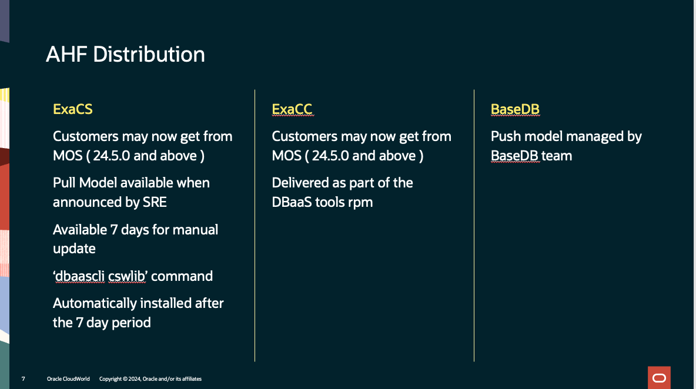
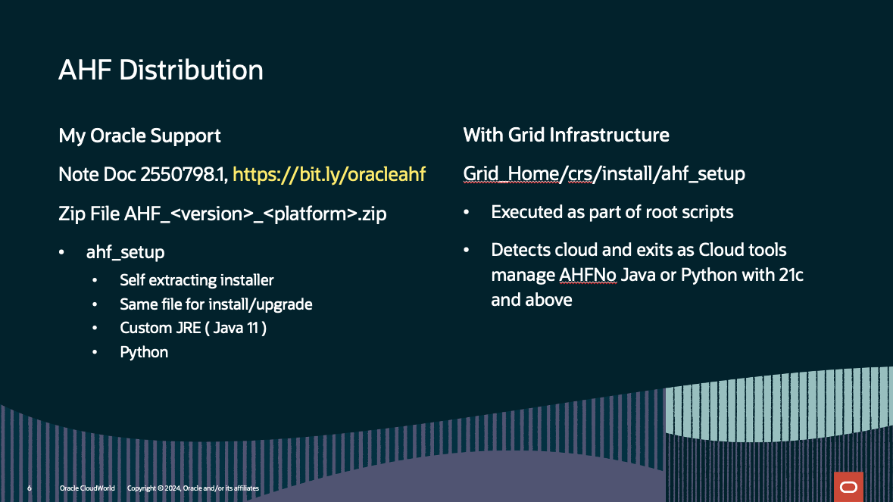
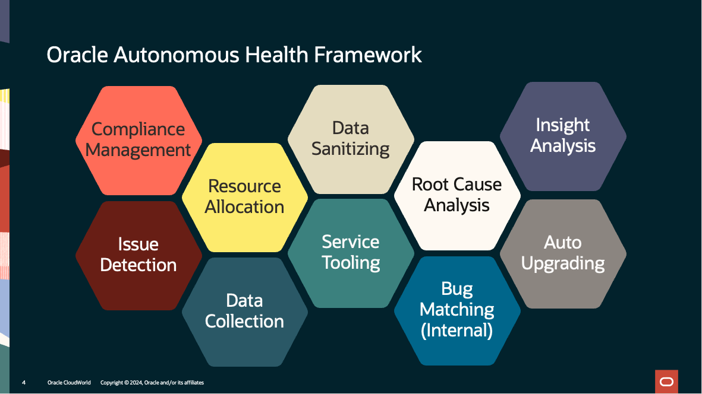

# Introduction

## About this Workshop
Oracle Autonomous Health Framework (AHF) is deployed automatically across various Systems, and all new versions can be Downloaded from My Oracle Support.
AHF is avilable for all Major Platforms supported by Oracle Database 19c and above. It is deployed as part of Grid Infrastructure and Oracle Database.

AHF is also deployed on all Database Cloud Systems automatically

In this workshop you will work on a sandbox  2-node Oracle Real Application Clusters database in the Oracle Cloud.  Oracle Cloud Infrastructure offers 2-node RAC DB systems on virtual machines.

You will be using the VM.Standard2.2 shape with 4 OCPUs and 60GB of memory.

For more about Virtual DB systems, click [here](https://docs.cloud.oracle.com/en-us/iaas/Content/Database/Concepts/overview.htm).

Estimated Workshop Time:  1.5 hours

Watch the video below for walkthrough of this workshop. TODO - Decide if we want a Video like this one for the RAC Lab

[Complete Walkthrough](videohub:1_o8hyf6k0)

### About Oracle Autonomous Health Framework (AHF)
The Oracle Autonomous Health Framework product contains a number of integrated proactive and reactive tools that try to help maintain 24x7 availability of cloud and on-premise systems by ensuring compliance to best practice,  monitoring, notifying customers of issues seen and generating diagnostic collections when problems do occur.  AHF goes from telling you how to avoid issues with best practice checking to speeding up logging Support Requests after detecting an issue and gathering the required diagnostics.

Best Practice Compliance checking is achieved with  Orachk/EXAchk. Cluster and Single System Health Monitoring gathers Operating System level statistics for all the processes on each node and has an analyzer that can be used to determine  possible O/S and or process issues. Database Anomaly detection through Cluster Heath Advisor monitors Database statistics and matches current performance metrics against a model to determine when a database might be about to get in to trouble or already is performing more slowly than is expected. TFA Monitors various sources for detected problems and gathers diagnostics for those problems.  TFA will gather logs, traces, Operating system and Database Cluster Health data as well as compliance data that DBA’s and Support can use to determine the cause of a problem. TFA optionally also sends event details to subscribers for onward notification to Operations and Customers.
Insights brings all that collected data into a dynamic web page that can be viewed in any normal Browser.

### About Oracle Autonomous Health Framework Command Line Interface 
As the AHF product evolved various tools that already had their own command line interface were pulled in the AHF.  There is an ongoing project to pull all of these tools under the single 'ahf' command line interface but as this is not complete you will find throughout this lab that you are asked to use tool specific command line interfaces in a number of cases.

Watch the video below for an overview of Oracle RAC.

[Full Overview Video of RAC](youtube:CbIGJs_eNtI)

### Objectives
- Connect to a DB System
- Understand how to identify and Check AHF
- Upgrade AHF to the latest version
- Know how to set up Auto Update of AHF for larger fleets
- Use AHF to detect and triage Incidents
- Gather and View AHF Insights reports

## More on Oracle AHF
Maybe put some links to Fix Flows here ?

## Learn more

* [Visit the AHF site on OTN](https://www.oracle.com/database/technologies/rac.html) TODO
* [Visit the Blog] (https://blogs.oracle.com/database/post/ahf-24-3)
## Acknowledgements

- **Authors/Contributors** - Troy Anthony, Bill Burton
- **Last Updated By/Date** - Bill Burton, July 2024
